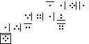

<h1 align="center">T Code</h1>

<p align="center">

</p>

<p align="center">
A text to image cryptography
</p>

## Table of contents

* [What is it?]()

* [How does "T Code" it work?]()
  * [Alphabet]()
  * [Forming sentences]()

* [How to use "T Code" Python script encoder?]()
  * [Requirements]()
  * [Using CLI encoder]()
  * [Using it on code]()

* [Decoder?]()

## What is it?

As the text on the top of this README says, it is a text to image cryptography. Actually, T Code concept is about transforming normal text to encoded text with a bunch of symbols that are pretty much different from any language's alphabet. About, this repository, it gets plain text and encodes it to PNG.

You can use the same concept presented here to encode it by hand -- and it is much cooler, but making an algorithm for it was fun.

## How does "T Code" work

### Alphabet

T Code has an own alphabet of 28 symbols that supports the whole latin alphabet (26 symbols), space (` `, 1 symbol) and period (`.`, 1 symbol). 

For coding reasons, all the latin alphabet symbols are considered as lower case, it can be upper case if you want if you are trying to encode or decode by hands, but I had to decide it to code this. This means T Code is case insensitive.

You can check the 28 symbols by looking at the folder `imgs/alphabet`, or looking at the table below.

<p align="center">

| | | | |
| --- | --- | --- | --- |
|  - ` ` (space) |  - `g` |  - `n` |  - `u` |
|  - `a` |  - `h` |  - `o` |  - `v` |
|  - `b` |  - `i` |  - `p` |  - `w` |
|  - `c` |  - `j` |  - `q` |  - `x` |
|  - `d` |  - `k` |  - `r` |  - `y` |
|  - `e` |  - `l` |  - `s` |  - `z` |
|  - `f` |  - `m` |  - `t` |  - `.` |

</p>

So any other ASCII character or letter ot alphabet are simply not supported. For the code, it just changes numbers digits to its forms in word (in english), replaces `?` and `!` for `.` and erase everything else to avoid exceptions. 

So using the text: 

<p align="center">
<code>Hey, bro!!1! That's a REALLY nice cryptography you got there!!! :D</code>
</p>

It will be transformed to:

<p align="center">
<code>hey bro..one . thats a really nice cryptography you got there... d</code>
</p>

To be properly encoded. So avoid trying this kind of text. Or not, it's up to you.

All images are 16x16 pixels because it's easier.

### Forming sentences

As you can see, all symbols have a line that can be at the top, bottom, right or left of the symbol image. This line indicates the direction of the next symbol in a sentence. So if you get `abc` for example, the three letters will be disposed side by side, from the left to the right, since the lines in those symbols are facing the right direction.

<p align="center">
  
</p>

But it is not just that. We mark the start of the sentence with an outside border. So using again the example of `abc` we got:

<p align="center">

</p>

Another example with `t code is fun`:

<p align="center">

</p>

And a last one with the sentence from the previous section (`hey bro..one . thats a really nice cryptography you got there... d`):

<p align="center">

</p>

## How to use "T Code" Python script encoder

### Requirements

First of all you need Python 3 installed. It's not a big deal. Also, you need [Pillow](https://pypi.org/project/Pillow/), which is also not a big of a deal.

But if you want to create a Python [virtualenv](https://virtualenv.pypa.io/en/latest/) similar to mine, you can do it by using `reqs.txt` to install the packages I have.

```
pip install -r reqs.txt
```

### Using CLI encoder

After having all set, you can enter the folder of the repository with your terminal and run like this:

```
python3 index.py [TEXT] [[save]] [[OUTPUT]]
```

* `TEXT` - Is a mandatory entry. It is the text you want to encode.
* `save` - Is an optional entry that says you want to save the image. If you entry anything else in this position, it will not work and ignored, so the image will just pop up at the end of the execution.
* `OUTPUT` - Is an optional entry that indicates the path name of the output image, if you want to save it. If you don't enter `save`, `OUTPUT` will be ignored. If you enter `save` and don't `OUTPUT`, an image with a datetime-based name will be saved.

### Using it on code

The whole algorithm is based on three main functions: `clear_text`, `get_text_array`, `matrix_to_image`.

* `clear_text` - It will basically transform the text as said in [alphabet section]().
* `get_text_array` - With the text already correctly processed, it will create an array that corresponds to the final image, but with `0` on empty spaces, the actual chars on the correct spots and the initial char plus a `*` that indicates the first symbol/letter.
* `matrix_to_image` - With the generated matrix, it just creates the image and returns it as an object.

So your code will look like the below:

```python
from utils.handle_text import clear_text
from utils.handle_matrix import get_text_array
from utils.handle_images import matrix_to_image

text = 't code is fun'
t = clear_text(text)
l = get_text_array(t)
img = matrix_to_image(l)

img.save('Example.png')
```

## Decoder?

Could be done, but decoding it without computer power is cooler.